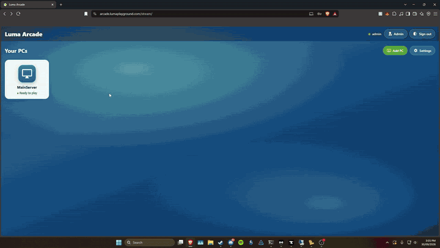
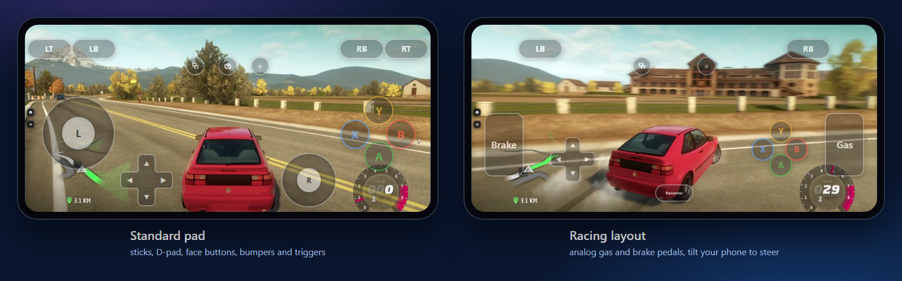
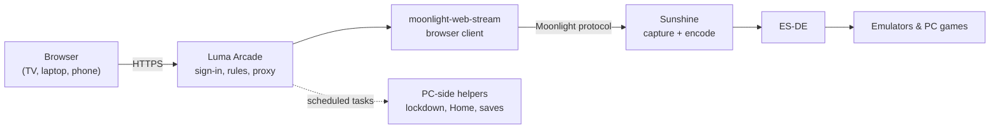

<div align="center">

# Luma Arcade

### Your own Stadia, for your friends.

**Send a link, and seconds later they're playing your PC's games in their browser.**<br>
No app to install, no account needed - like a Jackbox room code, but for any game on your PC.

Free and open source. Runs on your own Windows gaming PC, set up by a one-click installer.

<a href="https://github.com/Luma-exe/luma-arcade/releases/latest/download/LumaArcadeSetup.exe"></a>

<sub>Windows 10, 11 or Server, 64-bit · [All releases](https://github.com/Luma-exe/luma-arcade/releases) · [What you need](#what-you-need)</sub>



<sub>&#9654; <a href="https://github.com/Luma-exe/luma-arcade/raw/main/docs/luma-arcade-demo.mp4">Download the demo in full quality</a> (0:55)</sub>

[](https://github.com/Luma-exe/luma-arcade/actions/workflows/test.yml)


[](LICENSE)

[What you need](#what-you-need) · [Install](#install) · [Features](#features) · [How it works](#how-it-works) · [Development](#development) · [Troubleshooting](#troubleshooting)

</div>

---

## Features

| | |
|---|---|
| **Play anywhere** | Stream the PC's games to any browser - TV, laptop or phone - with controllers, touch controls and automatic quality that adapts to the connection. |
| **Accounts and fair turns** | One player at a time, with hand-over requests, a waiting line, idle hand-over and admin take-over. |
| **Co-op** | Invite up to three more players onto the same screen, or let people watch. |
| **Guest links** | Share a link that gives someone without an account a turn, or a seat in your game, for a set time. Pick a game and the link opens straight into it - no menus. |
| **Your PC games** | Installed Steam and Epic games show up in the library by themselves, with their artwork, and stay in step as you install and uninstall. |
| **Per-player saves** | Everyone keeps their own emulator saves and ES-DE favorites, with snapshots they can restore. |
| **House rules** | Daily and weekly play time limits, announcements, messages, and a lockdown that keeps guests out of the PC's settings. |
| **Game tracking** | Play history per person and per game, a weekly summary and Discord alerts. |
| **Host health** | One screen that checks Sunshine, encoders, drivers, the virtual display, saves and backups - with fixes where it can, and a **Copy diagnostics** button for bug reports. |

## Play on your phone

No controller? Phones and tablets get **on-screen controls**, with layouts for Xbox, PlayStation and more, and special ones for racing (analog pedals, tilt to steer) and shooters (swipe to look). Drag any button to where your thumbs want it, and save your own layouts.

<p align="center"></p>

## What you need

**The gaming PC** (the host)

| | |
|---|---|
| **Windows** | Windows 10 or 11 (Home or Pro), or Windows Server 2019, 2022 or 2025 - 64-bit. Admin rights to install. Sunshine officially lists Windows 11. |
| **Graphics** | A hardware video encoder: an NVIDIA card with NVENC, an AMD card with VCE/VCN, or Intel 6th-gen Core (Skylake) or newer with Quick Sync. Almost every gaming PC has one. |
| **Processor and memory** | Core i3 or Ryzen 3 or better, 4 GB of RAM or more ([Sunshine's minimums](https://github.com/LizardByte/Sunshine)). |
| **Monitor** | Not needed - Setup can add a virtual display for a PC with nothing plugged in. |
| **Network** | A wired connection is best. About **10-15 Mbps of upload per player** for 1080p at 60 fps - check your upload speed if friends will play from outside your home. |
| **Disk** | About 210 MB for Luma Arcade, plus the emulators you pick and your games. |
| **Internet during setup** | Setup downloads Sunshine, ES-DE and the emulators from their official releases. |

**The players**

| | |
|---|---|
| **Device** | Anything with a modern browser - TV, laptop, phone or tablet. Nothing to install. Chrome and Edge work best, especially with controllers. |
| **Controllers** | Optional: a USB or Bluetooth controller on their device, or on-screen touch controls on a phone. |
| **From outside your home** | A free [Cloudflare](https://www.cloudflare.com/) account and a domain name for the tunnel - Setup asks for its token. No ports to open. |

## Install

[Download **`LumaArcadeSetup.exe`**](https://github.com/Luma-exe/luma-arcade/releases/latest/download/LumaArcadeSetup.exe) and run it. Setup walks you through everything and leaves nothing to configure by hand afterwards.

| Step | What Setup does |
|---|---|
| **What to install** | *Everything* (streaming), *ES-DE + emulators* (play on this PC), or *just the emulators* - then pick exactly which emulators. |
| **Windows edition** | Detects Windows 10/11 or Server, and on Server turns the sound on. |
| **Hardware** | Warns if there's no NVIDIA, AMD or Intel graphics to encode with, and offers a [virtual display](https://github.com/VirtualDrivers/Virtual-Display-Driver) for PCs with no monitor. |
| **Controllers** | Xbox 360 or PlayStation 4 virtual controllers, with the drivers they need ([ViGEmBus](https://github.com/nefarius/ViGEmBus), Microsoft's Xbox 360 driver). |
| **Games account** | Creates a separate standard account that signs in by itself, so players never see your own desktop. |
| **Admin account** | Creates your admin sign-in, sets Sunshine's sign-in and pairs the two. |
| **Other devices** | HTTPS on the home network (browsers only allow controllers on secure pages) and an optional Cloudflare Tunnel for playing away from home. |
| **PC-side helpers** | Installs the scripts and scheduled tasks behind lockdown, the Home button, per-player saves, game tracking and window focus. |

Everything is downloaded from official releases at **versions tested with Luma Arcade**, each checked against its SHA-256 before it's installed ([`versions.json`](installer/scripts/versions.json)). BIOS and firmware files are never included.

> [!TIP]
> **Upgrading** is the same: run the new `LumaArcadeSetup.exe`. It stops Luma Arcade, keeps your accounts, settings, saves and certificate, skips emulators you already have, and starts it again.

<details>
<summary><b>Silent install</b> (scripted setups)</summary>

<br>

```text
LumaArcadeSetup.exe /S [options] [/D=C:\Program Files\LumaArcade]
```

| Option | Meaning |
|---|---|
| `/TYPE=everything\|esde\|emulators` | What to install (default: everything) |
| `/EMULATORS=all\|none\|retroarch,dolphin,...` | Which emulators |
| `/GAMESDIR=D:\Games` | Games folder (default `C:\Games`) |
| `/ACCOUNT=<name>\|current` | Games account (default `Arcade`) |
| `/PASSWORDFILE=<file>` | Its password - required for a new account |
| `/ADMINFILE=<file>` | Admin name and password, on two lines |
| `/TUNNELTOKENFILE=<file>` | Cloudflare Tunnel token |
| `/NOAUTOLOGON` `/NOAUTOSTART` `/NOHTTPS` | Turn those off |
| `/SERVER` `/CLIENT` | Override the detected Windows edition |
| `/VDD` `/NOVDD` `/VIGEM` `/NOVIGEM` `/XUSB` `/NOXUSB` | Force a driver on or off |
| `/DS4` | PlayStation 4 controllers instead of Xbox 360 |
| `/LATEST` | Newest releases instead of the tested versions |

Secrets are read from files, which are copied and never changed. `/D=` must come last. Setup exits with code `2`, before changing anything, if the options don't add up.

`Uninstall.exe /S` removes Luma Arcade and keeps its data. Add `/REMOVEAUTOLOGON` and/or `/REMOVEACCOUNT` to stop the games account signing in, or delete it.

</details>

<details>
<summary><b>Adding or updating emulators later</b></summary>

<br>

Run as administrator:

```powershell
powershell -ExecutionPolicy Bypass -File "C:\Games\setup\install-games.ps1" -GamesDir "C:\Games" -WithEsDe -Emulators retroarch,dolphin
```

`-ListOnly` checks every download without installing; `-Latest` takes the newest releases instead of the tested ones.

</details>

<details>
<summary><b>Setting up a host by hand</b></summary>

<br>

1. Install [Sunshine](https://github.com/LizardByte/Sunshine) and [ES-DE](https://es-de.org/), and add ES-DE as a Sunshine application.
2. Build [moonlight-web-stream](https://github.com/MrCreativ3001/moonlight-web-stream) (Rust + web frontend; it runs as its own process).
3. In Luma Arcade's settings, point `moonlightWebStreamPath` and its port at that build and let Luma Arcade start it.
4. For the PC-side features, see [`host/README.md`](host/README.md).

> [!IMPORTANT]
> Stream from an account dedicated to games, never your own. Sunshine shows that account's desktop - files, browser sessions and saved passwords included - to whoever is playing.

</details>

## How it works



Luma Arcade is a small Node.js/TypeScript server (Fastify) that runs on the gaming PC. It serves the site on one port, reverse-proxies moonlight-web-stream under `/stream`, and manages its process. moonlight-web-stream's sign-in is the only login; Luma Arcade reads that session to decide who may play what, when. All capture, encoding and input is handled by Sunshine and moonlight-web-stream.

Because the server can't reach the games desktop itself, PC-side PowerShell helpers in `C:\ProgramData\LumaArcade` do that work, started through scheduled tasks and Sunshine's prep-commands.

<details>
<summary><b>Architecture notes</b></summary>

<br>

| Area | Where | Notes |
|---|---|---|
| **Auth** | `web/streamUser.ts` | Pages under `/stream` call `/stream/luma-api/...` (rewritten to `/api/...`) because moonlight's cookie is scoped to `/stream`. Access rules live in Luma Arcade's database (`web/access.ts`, `web/appAccess.ts`). |
| **Turns** | `web/sessions.ts`, `routes/handover.ts` | Whoever streams has the PC. Hand-over requests lapse after 10 s; idle players (15 min) hand over when asked; an abandoned game is released after 10 min (3 with someone waiting); the line holds a free PC for 90 s. |
| **Co-op** | `sessions.ts`, `routes/coop.ts` | Up to 4 players on one screen at the host's size and frame rate; needs `channels = 2` in `sunshine.conf`. Guests can't go Home or close the game. |
| **Guest links** | `web/guestLinks.ts` | `/g/<token>` signs a visitor in as a throwaway moonlight account whose time and expiry act as a play limit. A link with a game goes straight to its stream with `?continue=1`, and `POST /api/continue` starts that game (`games.ts` `queueLaunch`). |
| **Saves** | `host/profiles.ps1`, `routes/saves.ts` | A Sunshine prep-command swaps save folders and ES-DE stats to the incoming player; snapshots are kept per player. |
| **Limits and messages** | `web/limits.ts`, `web/announcements.ts`, `web/messages.ts` | Daily/weekly minutes, announcements and direct messages, delivered through one poll. |
| **Play history** | `web/playLog.ts`, `web/games.ts` | Every stream and every game played in ES-DE, with connection quality. |
| **Lockdown** | `web/lockdown.ts`, `host/lockdown.ps1` | While a non-admin streams, admin tools on the games desktop close as they open. Fails open if Luma Arcade stops. |
| **HTTPS** | `web/https.ts` | With `server/https.json` (written by Setup), the same site is also served over TLS on port 7778. |
| **Tunnels** | `web/requestOrigin.ts` | Forwarding headers are trusted from loopback only. Requests arriving through a tunnel count as internet and can't change settings that make the host run a file or rebind. |
| **moonlight process** | `remote/moonlightWebStream.ts` | Started with `--bind-address 127.0.0.1:<port> --path-prefix /stream`, restarted with capped backoff if it exits. |
| **Auto-start** | Scheduled task `\LumaArcade\LumaArcade` | Runs `LumaArcade.vbs --background` when the games account signs in, in that account's session. |

</details>

## Development

```bash
npm install
npm run dev:server   # Fastify on :7777, restarts on change
npm test             # the server's test suite
```

Point the `moonlightWebStreamPath` setting at a moonlight-web-stream build, open `http://localhost:7777` and sign in with a moonlight-web-stream account (an admin one for Settings). For a production-style run: `npm run build && npm run start`. The port is a setting, 7777 by default.

### Building the installer

```bash
npm run package   # needs NSIS (winget install NSIS.NSIS) and Node installed system-wide
```

This produces `installer/output/LumaArcadeSetup.exe`. It bundles the built server, `node.exe`, production `node_modules`, the customized moonlight-web-stream from `../moonlight-web-stream-bin/package` (or `MOONLIGHT_PACKAGE_DIR`) and the PC-side helper scripts. It never includes `data.json`, `cloudflare_turn.json` or backups.

| Path | Purpose |
|---|---|
| `installer/LumaArcade.nsi` | The installer and uninstaller |
| `installer/scripts/` | The steps it runs: games, Sunshine, drivers, Windows setup, PC-side helpers, network, first run, upgrade, uninstall |
| `installer/scripts/versions.json` | Tested download versions with checksums |
| `installer/scripts/update-versions.ps1` | Finds, downloads and checks newer releases |

The **Tested versions** workflow runs `update-versions.ps1` every Monday and opens a pull request with any new pins. It needs *Settings > Actions > General > Allow GitHub Actions to create and approve pull requests*.

## Troubleshooting

Start with **Settings > Host health** - most problems show up there, often with a fix. Reporting a bug? Use **Copy diagnostics** there and paste it into the [bug report](https://github.com/Luma-exe/luma-arcade/issues/new?template=bug_report.yml); names and IP addresses are taken out.

<details>
<summary><b>Controllers do nothing in games (Windows Server)</b></summary>

<br>

Windows Server has no Xbox 360 controller driver, so Sunshine's virtual Xbox pads never reach games. Re-run Setup and tick the Xbox 360 driver on the Controllers page, or choose PlayStation 4 controllers, which don't need it (Xbox-only PC games won't see them).

</details>

<details>
<summary><b>Black screen, or the stream disconnects straight away</b></summary>

<br>

If Sunshine's log says `Failed to start the specified application` or `Permission denied`, nobody is signed in on the PC's console. Sunshine can only capture and launch on the console session. Sign in there, or connect with `mstsc /admin` - a normal Remote Desktop connection opens a separate session and leaves the console empty.

</details>

<details>
<summary><b>Remote Desktop breaks the stream</b></summary>

<br>

A normal RDP connection to the streaming account starts a second session instead of resuming the console one. Use `mstsc /v:<host> /admin`. Capture only works on the console session ([LizardByte/Sunshine#1832](https://github.com/LizardByte/Sunshine/issues/1832)), so give local users a separate account over plain RDP rather than trying to stream a non-console session.

</details>

<details>
<summary><b>Other software stops starting after a reboot</b></summary>

<br>

Windows signs only one account in automatically. Software that needs its own interactive sign-in (Docker Desktop, for example) won't come back if the games account now owns the console.

</details>

<details>
<summary><b>Sunshine's <code>--creds</code> changed the wrong instance</b></summary>

<br>

`sunshine.exe --creds` always writes to the default install's state file, whatever config path you pass. For a non-default instance, use its `POST /api/password` endpoint instead.

</details>

<details>
<summary><b>moonlight-web-stream shows as not reachable</b></summary>

<br>

The detail line under that status says whether the process isn't running or isn't answering yet, and shows the last error it hit.

</details>

<details>
<summary><b>Running under PM2 instead of the scheduled task</b></summary>

<br>

- PM2 on Windows uses one fixed named pipe (`\\.\pipe\rpc.sock`), so two accounts' PM2 daemons collide (`connect EPERM`). Use scheduled tasks for a second account.
- Some PM2 versions misparse `-- <app args>`; use an `ecosystem.config.js` with an `args` array.
- `pm2 list`'s user column is cosmetic - check real ownership with `Get-WmiObject Win32_Process | ForEach-Object { $_.GetOwner() }`.

</details>

## Performance

Streaming quality depends on the host's GPU encoder (NVENC, AMF or Quick Sync) and the network, not on Luma Arcade. 1080p60 at 10-15 Mbps is comfortable on a wired connection with a modern GPU. Wi-Fi and internet routes add latency and loss that matter more than bitrate, so wire the host where you can. A browser client is a step behind a native Moonlight app on latency, which suits slower-paced games best.

## Roadmap

- **Linux hosts** - Sunshine already runs there; the work is the PC-side helpers. See the [plan](docs/linux-host-plan.md).
- Ideas and votes welcome in [Discussions](https://github.com/Luma-exe/luma-arcade/discussions).

## License

Luma Arcade is free software under the [GNU General Public License v3.0 or later](LICENSE). You can use, change and share it; if you share a changed version, share its source under the same license.

It's built on [Sunshine](https://github.com/LizardByte/Sunshine) (GPL-3.0), [moonlight-web-stream](https://github.com/MrCreativ3001/moonlight-web-stream) (GPL-3.0) and [ES-DE](https://es-de.org/) (MIT) - thank you to their authors.

Luma Arcade doesn't include or download any games, BIOS or firmware. Play only games you own.
